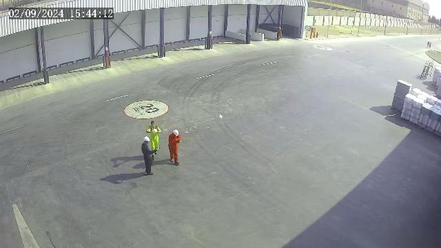
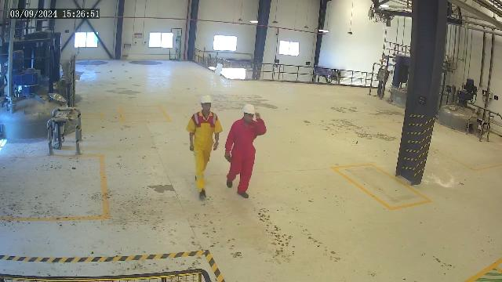
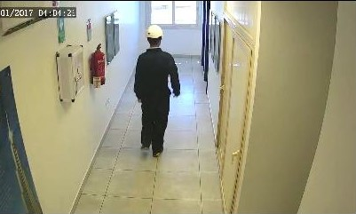

# PPE-Det
This repository provides the implementation and dataset for the paper **"PPE-Det: Lightweight Object Detection for Edge Devices"**, submitted to the **2nd International Conference on Intelligent Systems, Blockchain, and Communication Technologies (ISBCom) 2025**.  

The project focuses on evaluating lightweight object detection models for detecting **helmets and coveralls (red, blue, yellow)** in industrial environments. The models are optimized for **Raspberry Pi 5** using **PyTorch and NCNN frameworks**.  

---

## Table of Contents  
- [Dataset](#dataset)  
- [Methods](#methods)  
- [Results & Discussion](#results--discussion)  
- [Running the Experiment](#running-the-experiment)  

---
## Dataset

### Overview
The PPE-Det dataset comprises approximately **5,200 images** collected to facilitate Personal Protective Equipment (PPE) detection in industrial environments. The primary objective of this PPE-Det dataset is to enhance the accuracy of industrial models by providing diverse object detection samples in real-world scenarios. The images were extracted from a recorded video in an **Egyptian industrial setting** and split into frames at a rate of **2 frames per second (fps).**

### Preprocessing and Annotation
The PPE-Det dataset utilizes **bounding box annotations** to enable object detection. The annotations follow the **YOLO format**, where each labeled instance is represented by a class ID and four normalized values (**center x, center y, width, height**) defining the bounding box.

All images were initially **auto-labeled using an object detection model**. The auto-generated labels were then manually reviewed and corrected for accuracy. All images were resized so that the largest dimension is **640 pixels**, while preserving the aspect ratio.

### Class Distribution
The PPE-Det dataset contains object instances categorized across three distance ranges: **Far, Mid, and Near**, representing different levels of detail and resolution.
The three distance ranges are quantified as follows: 
- **Near Range:** Approximately 2.5-3m
- **Mid Range:** 4-5m
- **Far Range:** 8-10m

These distances refer to the **camera height from the ground**.

| Class ID | Description      | Far-Range | Mid-Range | Near-Range | Total Instances |
|----------|------------------|-----------|-----------|------------|-----------------|
| 0        | Helmet            | 1,884      | 3,593      | 1,878       | 7,355           |
| 1        | Blue Coverall     | 1,412      | 553        | 385         | 2,350           |
| 2        | Red Coverall      | 338        | 1,604      | 855         | 2,797           |
| 3        | Yellow Coverall   | 341        | 1,669      | 905         | 2,915           |
| **Total**| -                | **3,975**  | **7,419**  | **4,023**   | **15,417**      |

### Number of Images per Distance Range
| Distance Range | Number of Images |
|----------------|------------------|
| Far-Range      | 1,695             |
| Mid-Range      | 1,676             |
| Near-Range     | 1,840             |
| **Total**      | **5,211**         |

### Data Splits and Organization
The data is split into three subsets: **70\% for training, 15\% for validation, and 15\% for testing**. 

The dataset is hierarchically organized. At the top level, the dataset is divided into three main splits: **train, val, and test**. Each of these splits is categorized into three subdirectories—**far, mid, and near**—based on object distance. Each of these subdirectories contains two subfolders: **images/** (JPG format) and **labels/** (TXT in YOLO format).

```
dataset/
│── train/
│   ├── far/
│   │   ├── images/ (JPG)
│   │   ├── labels/ (TXT in YOLO format)
│   ├── mid/
│   ├── near/
```

### YOLO Annotation Format
Each YOLO annotation file follows a structured format where each line represents an object in the image:
```
<class_id> <center_x> <center_y> <width> <height>
```

**Class ID Mapping:**
- **0:** Helmet
- **1:** Blue Coverall
- **2:** Red Coverall
- **3:** Yellow Coverall


### 🔗 Dataset Access
The PPE-Det dataset can be accessed via this [Google Drive Link](https://drive.google.com/drive/folders/1RPhOT1OLkAopfAbRdLiQo_hbQeRj2HT6?usp=sharing).

### 📸 Sample Images
Below are sample images representing the three distance ranges:
- **Far Range**: 
- **Mid Range**: 
- **Near Range**: 


---
## Methods 

### Selected Models
The following models were trained and evaluated on the PPE-Det dataset for object detection:

| Model       | Architecture | Description | 
|-------------|--------------|-------------|
| YOLOv5n     | Ultra-lightweight | Designed for fast inference on edge devices. |
| YOLOv8n     | Next-gen YOLO | Improved accuracy and efficiency over previous YOLO versions. |
| YOLOv9t     | Transformer-enhanced YOLO | Incorporates transformer layers for better feature representation. |
| YOLOv10n    | Enhanced lightweight | Optimized for better performance on low-power devices. |
| YOLOv11n    | Further optimized | Improved speed-accuracy tradeoff compared to YOLOv10n. |
| YOLOX-Nano  | Nano variant | Efficient object detection designed specifically for mobile and edge devices. |
| NanoDet-M   | Lightweight anchor-free model | Specializes in fast and efficient object detection. |

These models were evaluated based on metrics such as **Mean Average Precision (mAP) and Inference Time**. Performance evaluations were conducted on a **Raspberry Pi 5** to simulate real-world edge deployment scenarios.

### Models  Comparison

| Model         | Parameters (M) | GFLOPS |
|---------------|----------------|--------|
| YOLOv5n       | 2.5            | 7.1    |
| YOLOv8n       | 3              | 8.1    |
| YOLOv9t       | 1.97           | 7.6    |
| YOLOv10n      | 2.7            | 8.2    |
| YOLOv11n      | 2.58           | 6.3    |
| YOLOX-Nano    | 0.9            | 1.08   |
| NanoDet-M     | 0.95           | 0.72   |
| MobileNet-SSD | 2.25           | 0.85   |

### Architectural Overview

- **YOLOv5n:** Uses Cross-Stage Partial Networks (CSPNet) for enhanced gradient flow and reduced computational redundancy. Incorporates depthwise separable convolutions and a refined PANet-based neck for balanced detection speed and accuracy.

- **YOLOv8n:** Implements an anchor-free detection paradigm, improving localization precision with adaptive spatial feature fusion for efficient multi-scale learning.

- **YOLOv9t:** Integrates Transformer-based modules to enhance long-range dependencies and feature reuse. Utilizes depthwise separable convolutions to boost computational efficiency.

- **YOLOv10n:** Combines convolutional and attention-based techniques with a streamlined detection head, improving detection robustness and reducing parameter complexity.

- **YOLOv11n:** Incorporates enhanced multi-scale feature fusion and knowledge distillation mechanisms. Optimized activation functions and lightweight attention modules improve precision.

- **YOLOX-Nano:** Employs a decoupled head structure with an anchor-free approach, simplifying detection and enhancing adaptability to varying object sizes.

- **NanoDet-M:** Utilizes a one-stage anchor-free framework with an enhanced Feature Pyramid Network (FPN) for improved multi-scale aggregation and efficient localization.

- **MobileNet-SSD:** Uses MobileNetV3 backbone with SSDLite detection head, incorporating Squeeze-and-Excitation (SE) modules, h-swish activation, and Neural Architecture Search (NAS) for better accuracy and latency balance.

## Selected Device

The **Raspberry Pi 5** was chosen for this experiment due to its balance of computational power and affordability, making it suitable for real-time object detection. Its specifications are:

- **Processor:** Quad-core ARM Cortex-A76 (2.4 GHz)
- **Memory:** 8GB LPDDR4X RAM
- **Storage:** 64GB MicroSD card
- **Operating System:** Ubuntu Server

Compared to higher-cost alternatives like the NVIDIA Jetson, the RPi5 provides a cost-effective, widely accessible solution with strong community support.

---

## Results & Discussion

### Experimental Setup

The experiments were conducted in a controlled environment to ensure consistency across evaluations. Object detection models were deployed using Docker containers, running exclusively on CPU-based inference. Two different Docker images were utilized:
- `pytorch/torchserve:0.12.0-cpu` for non-standard YOLO models.
- `ultralytics/ultralytics:latest-arm64` for standard YOLO models.

The dataset was divided into training, validation, and test sets with a 70:15:15 ratio for balanced evaluation.

### Hyperparameter Tuning

The models were trained independently using the Adam optimizer with a learning rate of $5 \times 10^{-4}$ and a batch size of 64. A learning rate scheduler was applied based on validation loss for optimal convergence. Early stopping with a patience threshold of 10 epochs was used to enhance generalization performance.

### Evaluating Detection Accuracy

Detection accuracy was evaluated using **mAP@50** (IoU threshold at 50%) and **mAP@50-95** (average precision over thresholds from 50% to 95%). YOLO-based models achieved the highest accuracy, particularly YOLOv9t and YOLOv11n, with mAP@50 and mAP@50-95 scores of 0.973 and 0.78, respectively.

| Model         | Near (mAP50 / mAP50-95) | Mid (mAP50 / mAP50-95) | Far (mAP50 / mAP50-95) | All (mAP50 / mAP50-95) |
|---------------|-------------------------|------------------------|------------------------|------------------------|
| YOLOv5n       | 0.986 / 0.853           | 0.957 / 0.724          | 0.924 / 0.655          | 0.956 / 0.734          |
| YOLOv8n       | 0.989 / 0.858           | 0.953 / 0.724          | 0.928 / 0.666          | 0.96 / 0.738           |
| YOLOv9t       | 0.99 / 0.892            | 0.964 / 0.769          | 0.951 / 0.726          | 0.973 / 0.778          |
| YOLOv10n      | 0.983 / 0.843           | 0.955 / 0.71           | 0.941 / 0.688          | 0.963 / 0.73           |
| YOLOv11n      | **0.992 / 0.894**       | **0.966 / 0.771**      | **0.96 / 0.72**        | **0.973 / 0.78**       |
| YOLOX-nano    | 0.939 / 0.697           | 0.864 / 0.552          | 0.828 / 0.479          | 0.873 / 0.578          |
| Nanodet-M     | 0.876 / 0.656           | 0.775 / 0.513          | 0.739 / 0.428          | 0.785 / 0.505          |
| MobileNet-SSD | 0.744 / 0.46            | 0.429 / 0.193          | 0.412 / 0.163          | 0.536 / 0.28           |

### Inference Latency Evaluation

Inference latency was measured on a Raspberry Pi 5 using PyTorch and NCNN formats. The NCNN backend significantly reduced latency by over 60% for some models. The results are shown below:

| Model         | PyTorch (Near) (ms) | PyTorch (Mid) (ms) | PyTorch (Far) (ms) | PyTorch (All) (ms) | NCNN (Near) (ms) | NCNN (Mid) (ms) | NCNN (Far) (ms) | NCNN (All) (ms) |
|---------------|---------------------|--------------------|--------------------|--------------------|------------------|-----------------|------------------|------------------|
| YOLOv5n       | 298.55               | 301.33             | 290.78             | 296.22             | 104.97           | 106.55          | 103.78           | 105.25           |
| YOLOv8n       | 307.45               | 309.12             | 300.87             | 305.81             | 106.98           | 107.55          | 104.61           | 106.38           |
| YOLOv9t       | 358.11               | 359.79             | 350.25             | 356.05             | 125.33           | 126.45          | 123.65           | 124.81           |
| YOLOv10n      | 354.23               | 356.91             | 346.12             | 352.42             | -                | -               | -                | -                |
| YOLOv11n      | 324.55               | 326.78             | 315.89             | 322.41             | 111.45           | 112.68          | 108.87           | 111.00           |
| YOLOX-nano    | 240.33               | 242.10             | 235.82             | 238.75             | -                | -               | -                | -                |
| Nanodet-M     | **149.55**           | **150.78**         | **144.21**         | **148.18**         | -                | -               | -                | -                |
| MobileNet-SSD | 236.45               | 237.98             | 230.22             | 234.63             | -                | -               | -                | -                |

### Key Takeaways

- YOLOv9t and YOLOv11n outperform others in detection accuracy, particularly at far distances.
- Detection accuracy decreases with distance but remains strong for YOLOv9t and YOLOv11n.
- Smaller models (YOLOX-Nano, NanoDet-M, MobileNet-SSD) show lower accuracy due to reduced size and computational complexity.
- The NCNN backend provides a significant reduction in inference latency, especially for YOLOv5n and YOLOv8n.
- Inference latency is not significantly affected by camera distance.

